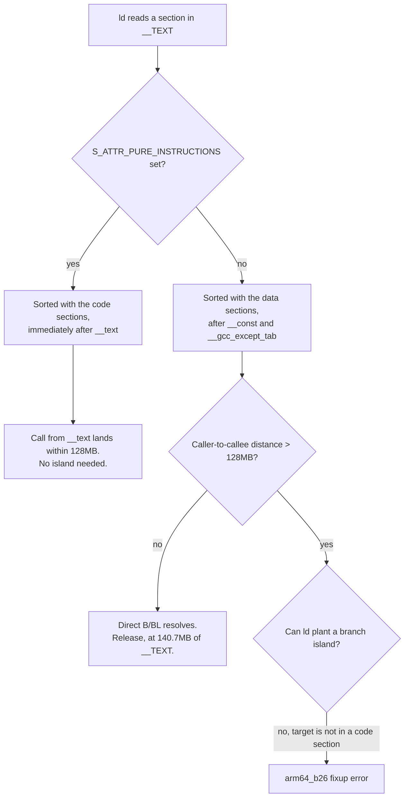

# LMDB text_env section: restoring the arm64 Debug link

| | |
|---|---|
| Status | Implemented |
| Author | Jon Tzeng |
| Reviewer | - |
| Last updated | 2026-09-07 |
| Repos | [react-native-monero](https://github.com/EdgeApp/react-native-monero) |
| Implementation | react-native-monero, branch `jon/monero-text-env-link` |
| Supersedes | - |
| Related | [piratechain-unified-wallet-sdk.md, The arm64 Debug link ceiling](https://github.com/EdgeApp/edge-currency-accountbased/blob/373bd8bb782cae9cf9bd0c099b39b9242b7d6a8b/src/docs/piratechain-unified-wallet-sdk.md#the-arm64-debug-link-ceiling), [accountbased#1055](https://github.com/EdgeApp/edge-currency-accountbased/pull/1055), [edge-react-gui#6021](https://github.com/EdgeApp/edge-react-gui/pull/6021) |

<!-- tdd-code-fingerprint: b465edbf502aa2f1f24a55a94aaa0563b1bbb1d0 -->

Line numbers and code quotes point at monero-project/monero pinned at `38bc62741b82cca179fb8e3437a388b0e0f67842`, the hash `scripts/libraries/lwsf.ts` checks out, and at branch `jon/monero-text-env-link` of react-native-monero. The failure and the acceptance bar come from Asana task 1218248088754561.

## Contents

1. [Problem](#1-problem)
2. [Prior art](#2-prior-art)
3. [Goals and non-goals](#3-goals-and-non-goals)
4. [Design overview](#4-design-overview)
5. [Testing](#5-testing)
6. [Phase history](#6-phase-history)
7. [Decisions](#7-decisions)
8. [Glossary](#8-glossary)
9. [References](#9-references)
10. [Post-implementation retrospective](#10-post-implementation-retrospective)

## 1. Problem

A Debug iOS simulator build of edge-react-gui with all four large native wallet libraries present (react-native-pirate-wallet, react-native-zcash, react-native-monero, react-native-zano) does not link. The linker reports:

```
ld: warning: symbols in __TEXT,text_env (libmonero-module.a[arm64][2](monero-module.o))
    have unwind information, but it's not a code section
    (missing 'regular,pure_instructions' section flag)
ld: fixup error (kind=arm64_b26) at '__ZN5boost6chrono12system_clock3nowEv'+0x450994
    from libmonero-module.a[arm64][2](monero-module.o), B/BL out of range
    (displacement=177426652, max is +/-128MB), from 0x00473394 to 0x0ADA8470 ('_mdb_mutex_failed')
```

An arm64 `B`/`BL` instruction reaches +/-128MB. For a farther call the linker plants a [branch island](#branch-island), but only into a section it recognizes as code. The `text_env` section carrying `mdb_mutex_failed` is not flagged as code, so ld sorts it past every real code section, at the far end of `__TEXT`, and then has nowhere legal to put the island.

Only Debug crosses the reach. Measured on `agent/1214721783909451`, Debug `__TEXT` is 190.0MB against 140.7MB in Release, and the gap widened 2.2MB between the pirate-wallet 0.3.0 and 0.3.4 measurements, so it grows with each SDK bump. Release links on device and on the simulator, so the cost is local iteration rather than shipping.

## 2. Prior art

The standing workaround is to exclude react-native-zcash, react-native-monero and react-native-zano from iOS autolinking in the developer's own checkout, which shrinks `__TEXT` back under the reach. It is never committed, it disables three wallets in the build under test, and it has to be reapplied by every developer on every branch. It also cannot verify the pirate branch's acceptance case, which is that all four libraries load at once.

Two other framings were considered and rejected in [section 7](#7-decisions): shrinking Debug `__TEXT`, and asking the linker for a different layout.

## 3. Goals and non-goals

Goals:

- The untrimmed Debug simulator build of edge-react-gui links with all four large native wallet libraries autolinked.
- `libmonero-module.a` ships a `text_env` section the linker treats as code, on every slice of the [XCFramework](#xcframework).
- The fix survives the next monero bump with a build failure rather than a silent regression.

Non-goals:

- Reducing Debug `__TEXT` size. The margin under 128MB would be small and would erode with the next SDK bump.
- Changing anything in Release, which already links.
- Changing [LMDB](#lmdb) behavior. The patched functions keep their addresses relative to each other and their semantics.
- The Android build, which links a shared library and never hits the arm64 static-link island problem.

## 4. Design overview

| Repo | Deliverable | Scope |
|---|---|---|
| react-native-monero | `scripts/libraries/lwsf.ts` | One anchored patch to the vendored [LMDB](#lmdb) source, applied at clone time, plus a cacheTag revision |
| edge-react-gui | `package.json` version bump | Consumer, no code change; blocked on publishing react-native-monero |

### 4.1 Where the section comes from

The [LWSF](#lwsf) build compiles monero's tree, which vendors LMDB at `external/db_drivers/liblmdb/mdb.c`. That file groups its rarely used environment functions into a private section through the `ESECT` macro:

```c
// external/db_drivers/liblmdb/mdb.c
#ifdef __GNUC__
/** Put infrequently used env functions in separate section */
# ifdef __APPLE__
#  define	ESECT	__attribute__ ((section("__TEXT,text_env")))
# else
#  define	ESECT	__attribute__ ((section("text_env")))
# endif
#else
#define ESECT
#endif
```

About 50 functions carry `ESECT`, `mdb_mutex_failed` among them.

The Apple spelling is a two-field [Mach-O section specifier](#mach-o-section-specifier): segment and section, with no type and no attributes. Clang then emits the section as type `S_REGULAR` with `S_ATTR_SOME_INSTRUCTIONS` and without `S_ATTR_PURE_INSTRUCTIONS`. Compiling one function each way for `arm64-apple-ios-simulator` gives:

| Section attribute in the source | Section flags in the object file |
|---|---|
| `section("__TEXT,text_env")` | `0x00000400` |
| `section("__TEXT,text_env,regular,pure_instructions")` | `0x80000400` |
| (none, so the function lands in `__text`) | `0x80000400` |

`0x80000000` is `S_ATTR_PURE_INSTRUCTIONS`. Without it the section is data as far as ld's layout is concerned.

### 4.2 What the linker does with it



The measured layouts of the linked Debug simulator binary confirm both paths. Before, with the published module, `text_env` sits between `__gcc_except_tab` and `__unwind_info`:

| Section | Address before | Address after |
|---|---|---|
| `__text` | `0x000002f00`, size `0x005f6afb8` | `0x000002f00`, size `0x005f6b6b8` |
| `text_env` | `0x00ada62e0` (173.6MB in) | `0x005f6e5b8` (95.7MB in) |
| `__gcc_except_tab` | `0x00a9e48f4` | `0x00a9ed9f4` |
| `__unwind_info` | `0x00adac020` | `0x00adb2238` |
| `__TEXT` total | `0x00b558000` (181.5MB) | same order of size |

After the patch, `text_env` follows `__text` directly and precedes `__stubs`. The distance from any caller in `__text` to `mdb_mutex_failed` is now under the `B`/`BL` reach, so no island is needed at all.

### 4.3 The patch

`monero.clone` in `scripts/libraries/lwsf.ts` already rewrites three files of the checked-out monero tree (`CMakeLists.txt`, `src/cryptonote_basic/miner.cpp`, `src/net/http.cpp`). The LMDB patch is a fourth, in the same anchored-replace style, spelling the section out in full:

[`scripts/libraries/lwsf.ts`](../../scripts/libraries/lwsf.ts)
```ts
const patchedMdbC = mdbC.replace(
  '#  define\tESECT\t__attribute__ ((section("__TEXT,text_env")))',
  '#  define\tESECT\t__attribute__ ((section("__TEXT,text_env,regular,pure_instructions")))'
)
if (!patchedMdbC.includes('text_env,regular,pure_instructions')) {
  throw new Error(
    'lmdb mdb.c ESECT patch anchor did not match the pinned source'
  )
}
```

The string itself is not the whole change.

The anchor assertion answers the task's "record how the patch survives the next monero bump". `String.replace` returns the input unchanged when the pattern misses, so a drifted upstream would leave the build producing an unpatched module and a link that fails again for a reason nobody would connect to this change. The throw turns that into a build failure naming the patch. The existing `rpc.cpp` patch in the same file uses the same guard.

The cacheTag now carries a patch revision:

[`scripts/libraries/lwsf.ts`](../../scripts/libraries/lwsf.ts)
```ts
const moneroPatchTag = '1-esect'

addTask({
  name: 'monero.clone',
  cacheTag: `${moneroHash}-${moneroPatchTag}`,
```

The tag does not hash the patch text, so an edited patch under an unchanged tag is invisible to the cache: `monero.clone` is skipped outright on a hit and the tree keeps whatever the previous run left in it, unpatched or patched to the older text. The leading revision digit is the part that moves, so the next patch edit is a one-character bump rather than a rename.

## 5. Testing

Case 1 through case 3 are the task's acceptance criteria. All ran on 2026-09-07 against edge-react-gui at `f15eb640` (branch `agent/1214721783909451`, react-native-pirate-wallet 0.3.4), with react-native-zcash, react-native-monero and react-native-zano all autolinked, on simulator `agent-sim-pool-0` (iOS 18.6).

1. **Compile-level section flags.** A single function compiled for `arm64-apple-ios-simulator` under each spelling of the attribute, read back with `otool -l`. Result: the two-field spelling gives flags `0x00000400`, the four-field spelling gives `0x80000400`. Table in [section 4.1](#41-where-the-section-comes-from).

2. **Shipped-artifact section flags.** `otool -l` over `libmonero-module.a` in each slice of the rebuilt `MoneroModule.xcframework`. Result: `text_env` carries flags `0x80000400` on `ios-arm64` and on both architectures of `ios-arm64_x86_64-simulator`. The published 0.4.2 artifact carries `0x00000000` on all three.

3. **Untrimmed Debug simulator link.** Two runs of the same `xcodebuild -configuration Debug` invocation over the same DerivedData, differing only in which `MoneroModule.xcframework` sat in `node_modules/react-native-monero/ios/`.
   - With the published 0.4.2 framework: `** BUILD FAILED **`, with the `text_env` unwind warning and [`arm64_b26`](#arm64_b26) with `... displacement=177426652 ... '_mdb_mutex_failed'`, reproducing the reported failure exactly.
   - With the rebuilt framework: `** BUILD SUCCEEDED **`, zero occurrences of `arm64_b26` and zero of `text_env` in the build log.

4. **App launch on the rebuilt module.** The linked app installed and launched on the simulator, logged in, and rendered its wallet list with Zano, Monero and the rest of the plugins live.

5. **Monero sync.** On account `edge-rjqa3`, wallet "My Monero" resolved a balance of 0.001891391795 [XMR](#xmr) ($0.97) and its fiat rate, so the [LWSF](#lwsf) refresh completed against the rebuilt module.

6. **Monero send to terminal success.** From that wallet, 0.000484 XMR (network fee 0.00017752 XMR) to "My Monero 3" in the same account. The app reached the "Transaction Success: Your transaction has been successfully sent." confirmation, so `createTransaction` and `broadcastTransaction` both executed on the rebuilt module.

Case 4 through case 6 ran the 0.4.2 JavaScript against the rebuilt 0.5.0-source native module. The 0.4.2 JavaScript came from the pirate branch's `node_modules` (edge-react-gui `agent/1214721783909451` pins 0.4.2 and its compiled edge-currency-accountbased 4.87.0 consumes it), not from current develop, which already pins 0.5.0. The skew is safe for the send path because that compiled `MoneroEngine.broadcastTx` awaits `broadcastTransaction` and discards its return value, which is the only surface 0.5.0 changed.

## 6. Phase history

### Phase 1 (2026-09-07): the section-flag fix

Sketched as scope item 1 of the task: find what emits `__TEXT,text_env` and either flag those functions as code or drop the custom section.

Shipped as the four-field section specifier, keeping the section. Divergence from the sketch: none in mechanism. Two things the sketch did not name and the implementation needed:

| Item | Why it was needed |
|---|---|
| `moneroPatchTag` in the clone cacheTag | `getRepo` re-checks-out the tree, so a cache hit silently reuses an unpatched monero |
| The anchor assertion | An anchored `String.replace` no-ops on drift, which would resurrect the exact bug on the next monero bump |

Deferred: publishing react-native-monero and bumping it in edge-react-gui. The publish needs the operator's npm second factor and follows this repo's convention of a standalone version commit. The gui bump is the plain pin change the task's scope item 2 anticipated: edge-react-gui develop and edge-currency-accountbased master already pin 0.5.0, and accb's `MoneroEngine.ts` already consumes the `BroadcastResult` that 0.5.0 introduced, so the next release moves the pin from 0.5.0 to 0.5.1 with no code change on either side.

## 7. Decisions

### 7.1 Flag the section as code rather than removing it

Chosen: spell the Mach-O specifier out in full so `text_env` carries `S_ATTR_PURE_INSTRUCTIONS`.

Evidence: the compile probe in [case 1](#5-testing) shows the four-field form produces exactly the flags `__text` has, and the linked-binary layout in [section 4.2](#42-what-the-linker-does-with-it) shows ld then sorts the section with the code and needs no island.

Rejected, defining `ESECT` to nothing so the functions land in `__text`: it also fixes the link, and it is a smaller string. It throws away what upstream wanted the macro for, which is keeping cold environment functions off the hot instruction pages. Since the flagged form fixes the link with the same one-line patch, there is no reason to also discard the grouping.

Reopen if: a future linker sorts a flagged non-`__text` code section far from `__text` anyway, in which case dropping the section is the remaining option.

### 7.2 Patch at clone time rather than vendoring mdb.c

Chosen: a `String.replace` inside the `monero.clone` task.

Evidence: `monero.clone` already patches `CMakeLists.txt`, `miner.cpp` and `net/http.cpp` this way, and the [`lwsf`](#lwsf) build step patches `rpc.cpp` with an anchor assertion. One more entry costs 30 lines and no new machinery.

Rejected, vendoring a patched copy of `mdb.c` into this repo: it would pin an 11,255-line third-party file that the repo deliberately does not carry (the package documentation says the third-party C++ sources are too large to include), and every monero bump would need a manual re-diff instead of a build failure at the anchor.

Rejected, upstreaming to [LMDB](#lmdb) or monero: worth doing eventually, but an upstream fix does not reach this build until monero bumps its LMDB, so it cannot be the mechanism here.

Reopen if: the patch count in `monero.clone` grows past what one reader can follow, at which point a patch directory with real `.patch` files is the better shape.

### 7.3 Keep the monero source pin where it is

Chosen: no change to `moneroHash`.

Evidence: the failure is in a compile-time attribute the pinned tree already carries, and [case 3](#5-testing) shows the patched pin links.

Rejected, bumping monero in the hope a newer LMDB fixes it: LMDB has carried this `ESECT` definition unchanged for years, and a monero bump would drag unrelated wallet-behavior changes into a link fix.

Reopen if: monero's own reasons force a bump (a security fix, a wallet feature this package needs), at which point the anchor assertion in [section 4.3](#43-the-patch) decides whether the patch still applies.

## 8. Glossary

### Branch island

A small linker-generated stub placed within reach of a caller, which then performs a longer-range jump to the real target. On arm64 a direct `B`/`BL` encodes a +/-128MB signed displacement, so ld inserts islands to reach anything farther. It can only place one inside a section it treats as code, which is why this failure is a layout problem rather than a distance problem. See [Apple's ld64 branch-island source](https://github.com/apple-oss-distributions/ld64/blob/main/src/ld/passes/branch_island.cpp).

### arm64_b26

The fixup kind ld names for a 26-bit branch displacement, the encoding used by `B` and `BL` on arm64. "fixup error (kind=arm64_b26)" means the relocation could not be resolved because the target sits outside that displacement and no [branch island](#branch-island) could be placed. See the [ARM A64 B instruction encoding](https://developer.arm.com/documentation/ddi0602/latest/Base-Instructions/B--Branch-).

### LMDB

Lightning Memory-Mapped Database, a small embedded key-value store. monero vendors it at `external/db_drivers/liblmdb` and this build compiles it as part of the monero tree. Its `mdb.c` is the single file that defines the `ESECT` macro at the root of this problem. See [LMDB at OpenLDAP](https://www.openldap.org/software/repldap/).

### LWSF

The light-wallet server front end at [vtnerd/lwsf](https://github.com/vtnerd/lwsf), pinned in `scripts/libraries/lwsf.ts`. It builds against a monero source tree and produces the wallet libraries this package links into `monero-module.o`, which is why a monero-vendored file ends up inside `libmonero-module.a`.

### Mach-O section specifier

The string clang accepts in `__attribute__((section(...)))` on Apple platforms, of the form `segment,section[,type[,attribute+...][,sizeof_stub]]`. Only the first two fields are required; the type and attributes default in a way that leaves a code section unmarked as code. See [Apple's Mach-O section type and attribute documentation](https://developer.apple.com/documentation/kernel/section_64).

### XMR

The ticker for Monero, the asset this package's wallets hold and spend. Amounts in [section 5](#5-testing) are in XMR; one XMR was $516 at the time of the test. See [getmonero.org](https://www.getmonero.org/).

### XCFramework

Apple's container for one binary per platform and architecture slice, here `ios-arm64` for devices and `ios-arm64_x86_64-simulator` for the simulator. `scripts/build-native.ts` produces it with `xcodebuild -create-xcframework`, and the podspec consumes it as `vendored_frameworks`. See [Apple's XCFramework documentation](https://developer.apple.com/documentation/xcode/creating-a-multi-platform-binary-framework-bundle).

## 9. References

- Asana task 1218248088754561, which carries the original ld log and the segment layout captured on 2026-09-07.
- [piratechain-unified-wallet-sdk.md, The arm64 Debug link ceiling](https://github.com/EdgeApp/edge-currency-accountbased/blob/373bd8bb782cae9cf9bd0c099b39b9242b7d6a8b/src/docs/piratechain-unified-wallet-sdk.md#the-arm64-debug-link-ceiling).
- [monero-project/monero @ 38bc627, external/db_drivers/liblmdb/mdb.c](https://github.com/monero-project/monero/blob/38bc62741b82cca179fb8e3437a388b0e0f67842/external/db_drivers/liblmdb/mdb.c#L247-L256).

## 10. Post-implementation retrospective

### Estimate vs. actuals

| Step | Expected | Actual |
|---|---|---|
| Locate the emitter | Unknown, possibly a build flag or pragma | One grep of the pinned `mdb.c`, ~5 minutes |
| The patch | One line | One line, plus the cacheTag and the anchor assertion |
| Rebuild the [XCFramework](#xcframework) | Long | ~50 minutes for boost, OpenSSL, libunbound, libzmq, monero and [LWSF](#lwsf) across three iOS slices |
| Prove the link | One build | Two builds, one per framework, sharing DerivedData |

### Where this document was wrong or silent

1. An earlier revision of this document claimed the gui bump crosses 0.5.0's breaking `broadcastTransaction` change and so is not the "version bump only" the task's scope item 2 calls it. That claim came from reading the consumer out of the pirate branch's stale `node_modules` (edge-currency-accountbased 4.87.0 pinned to react-native-monero 0.4.2, [section 5](#5-testing)) instead of the main checkouts. edge-react-gui develop and edge-currency-accountbased master already pin 0.5.0 and accb already reads `txKey` from the result, so the task's description was right and the bump is a plain pin change ([section 6](#6-phase-history)).
2. Nothing in [section 4](#4-design-overview) anticipated the build-script prerequisites. `scripts/build-native.ts` calls `makePlatforms()`, which installs the Android NDK even for the iOS-only `xcframework` task, and its `sdkmanager` invocation passes the package name with literal quotes so the self-install fails. Installing NDK 26.1.10909125 by hand cleared it. That quoting is a real defect in `scripts/utils/android-tools.ts`, left alone here as unrelated scope.

### What held

The mechanism named in the task description, that the missing `regular,pure_instructions` flag is what stops the island, held exactly. The measured layout moved `text_env` from 173.6MB into `__TEXT` to 95.7MB, directly after `__text`, which is the predicted outcome and stronger than the prediction: no island is needed at all.

### Verification highlights

- Before: `** BUILD FAILED **`, `displacement=177426652`, `text_env` at `0x00ada62e0`.
- After: `** BUILD SUCCEEDED **`, zero [`arm64_b26`](#arm64_b26) and zero `text_env` lines, `text_env` at `0x005f6e5b8`.
- Send: 0.000484 [XMR](#xmr) moved between two wallets on `edge-rjqa3` and the app showed "Transaction Success".
